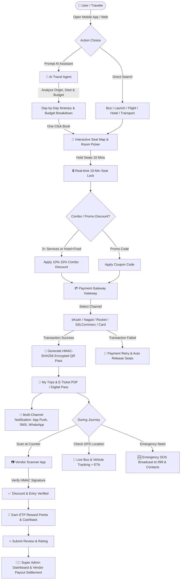

# Extra Travel Point — Travel Super App System Flowchart

Below is the complete end-to-end Mermaid flowchart representing the user journey, core modules, payment execution, QR digital pass verification, AI trip assistant, and Super Admin / Vendor operations for Extra Travel Point.

---

## System Sub-Flows Summary

### 1. User & AI Trip Planning Sub-Flow
1. User provides prompt: *"Dhaka to Kuakata, 3 Days, Budget 5000 BDT"*
2. AI calculates budget allocation (Transport 20%, Hotel 36%, Food 24%, Local 10%, Emergency 10%).
3. AI generates Day-1 to Day-3 itinerary with weather forecast.
4. User selects "One-Click Trip Booking".

### 2. Payment & QR Digital Ticket Sub-Flow
1. Payment initiated via bKash/Nagad/Rocket/SSLCommerz.
2. Webhook received with HMAC signature verification.
3. System issues HMAC-SHA256 signed QR ticket.
4. Vendor scans QR ticket using Vendor App scanner to verify validity and process payout.
